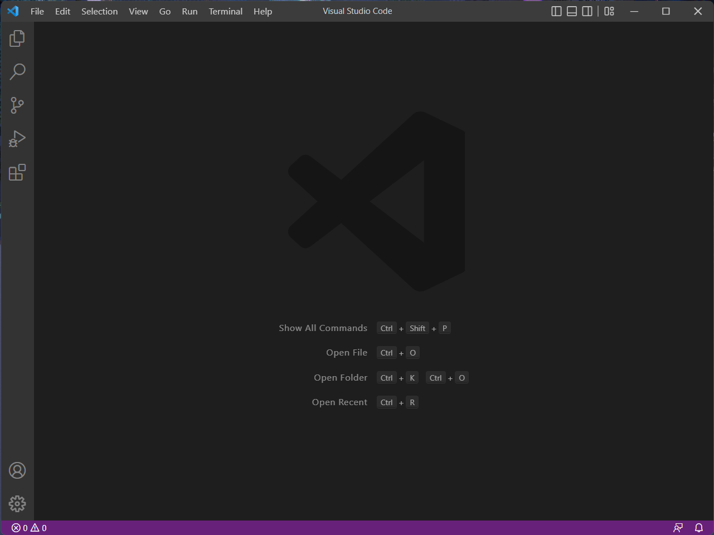
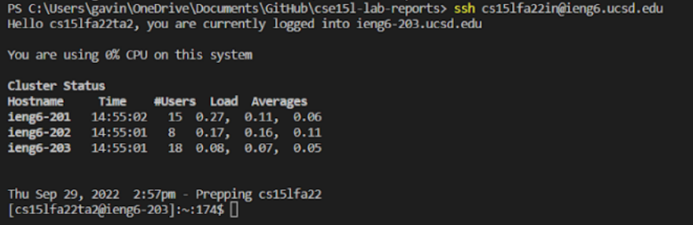
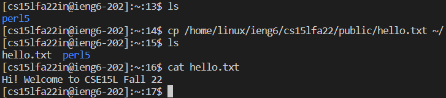
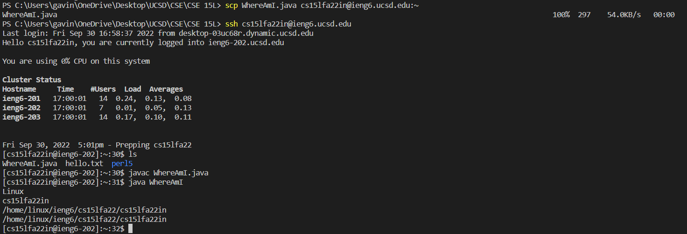
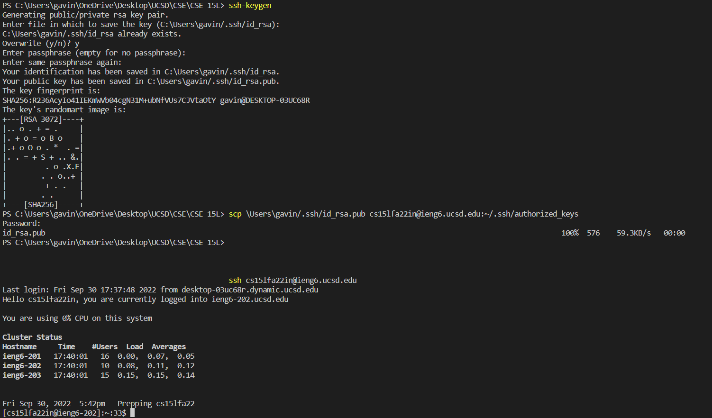
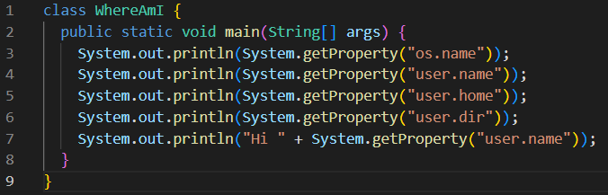
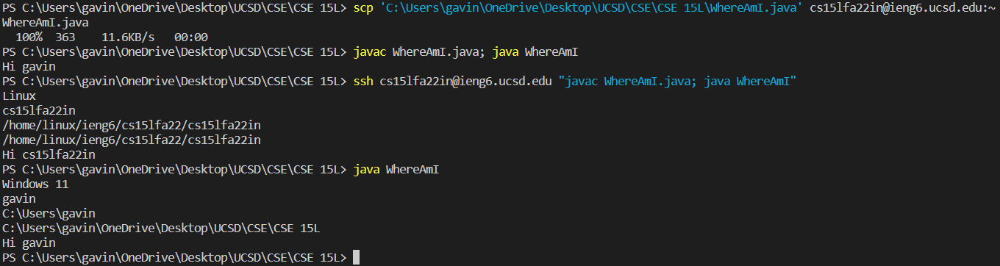

# Week 1 Lab Report
## **Tutorial: How to login to a course specific account on ieng6**
This tutorial will go over how to remotely log into your course specific account on ieng6. There are 6 steps that will be covered:
1. Installing VSCode
2. Remotely Connecting to ieng6
3. Trying Commands
4. Moving Files Over ssh Using the scp Command
5. Setting an SSH Key
6. Optimizing Remote Running

## Installing VSCode
To login to ieng6, I used an application called VSCode. To start, I downloaded VSCode from the website at [https://code.visualstudio.com/Download](https://code.visualstudio.com/Download) and followed the instructions according to my OS (Windows). Opening VSCode gave me the following screen



## Remotely Connecting to ieng6
To connect to ieng6, OpenSSH needs to be installed. My laptop already had it installed however the installation process can be followed via [this guide](https://learn.microsoft.com/en-us/windows-server/administration/openssh/openssh_install_firstuse?tabs=gui). To connect, I opened a terminal in VSCode with the shortcut Ctrl + ` and used the ssh command as follows:
```
ssh cs15lfa22xx@ieng6.ucsd.edu
```
Where "xx" is specific to your own account. A message popped up for the first time connecting to ieng6 in which I typed "yes" to continue connecting. I inputted the password and was then given information about the remote server. This interaction can be seen below:




Note: I used the TA account shown in the screenshot for this part as I was unable to login to my account at the time.

## Trying Commands
Now that we've successfully logged into ieng6, we can try running some commands remotely.



In the image above, I tried using the commands ls, cp and cat.  
**ls** was used to **list** the files found in the current directory. When first starting, there was only one directory in the home folder, perl5.  
**cp** was used to **copy** a file from a public folder for the cs course to my home directory. The file copied was hello.txt.
**cat** was used to **concatenate** or print out the text contained in the hello.txt document.

## Moving Files Over ssh Using the scp Command
To work between both the local computer and remote computer, we will need to copy files from one to the other using the scp command.



In the screenshot above, I copied the file WhereAmI.java from my local directory to the remote home directory using the scp command. I confirmed that it was successfully copied over using ls and by running WhereAmI in java, which shows that the program is being run from the remote directory.

## Setting an SSH Key
Logging into the remote server is quite tedious as you need to input your password every time to log in. To make switching between the remote and local accounts quicker and smoother, we can bypass the password requirement using an SSH key.



In the screenshot above, I created a public and a private key using the command **ssh-keygen**. I then copied the public key into the .ssh/authorized_keys directory in the remote server using the scp command. This allowed me to login to the remote server without needing to input the password.  

Note: Because I had already completed this step before taking a screenshot, I overwrote the previous key and did not need to create the .ssh directory when redoing the step to take a screenshot.

## Optimizing Remote Running

For the lab, I made the following change to the WhereAmI.java file:



To upload the changes to the remote server and run it, I used the following commands:



I used multiple commands in one line separated by a semicolon (;) to run commands one after the other. Additionally, I ran commands on the remote server and logged out immediately after by putting commands in quotation marks ("") after the ssh command. This made the process of uploading and compiling the code on the remote server quicker.

Note: The first time I ran the edited WhereAmI.java file, part of the output was cut off, which is why I ran it a second time.