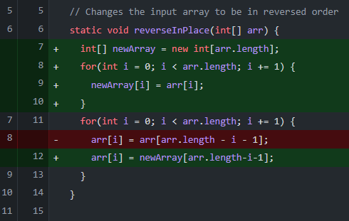

# Lab Report 2

## Part 1:

SearchEngine Code:

    import java.io.IOException;
    import java.net.URI;
    import java.util.ArrayList;

    class Handler implements URLHandler {

    ArrayList<String> strings = new ArrayList<>();

        public String handleRequest(URI url) {

            if (url.getPath().equals("/")) {
                String result = "";
                for (int i = 0; i < strings.size(); i++) {
                    if (result == "") {
                        result = result + strings.get(i);
                    } else {
                        result = result + " ," + result;
                    }
                }
                return "List of strings stored: " + result;
            }

            if (url.getPath().contains("/add")) {
                String[] parameters = url.getQuery().split("=");
                if (parameters[0].equals("s")) {
                    strings.add(parameters[1]);
                    return String.format("%s has been added to the list of strings!", parameters[1]);
                }
            }

            if (url.getPath().contains("/search")) {
                String[] parameters = url.getQuery().split("=");
                if (parameters[0].equals("s")) {
                    String result = "";
                    for (int i = 0; i < strings.size(); i++) {
                        if (strings.get(i).contains(parameters[1])) {
                            if (result == "") {
                                result = result + strings.get(i);
                            } else {
                                result = result + ", " + strings.get(i);
                            }
                        }
                    }
                    return "Search results: " + result;
                }
            }

            return "404 Not Found!";
        }
    }

    class SearchEngine {
        public static void main(String[] args) throws IOException {
            if(args.length == 0){
                System.out.println("Missing port number! Try any number between 1024 to 49151");
                return;
            }

            int port = Integer.parseInt(args[0]);

            Server.start(port, new Handler());
        }
    }

Using /add:

**Methods called:**

public String handleRequest(URI url)

**Initial values of relevant fields/arguments:**

URI url: localhost:4000/add?s=yogurt

ArrayList< String > strings: ["yo"]

String[] parameters: ["s", "yogurt"]

**Change in values:**

ArrayList< String > strings: ["yo", "yogurt"]

Returned value: "yogurt has been added to the list of strings!"

Home page:

**Methods called:**

public String handleRequest(URI url)

**Initial values of relevant fields/arguments:**

URI url: localhost:4000/

ArrayList< String > strings: ["yo", "yogurt", "yoplait", "daimyo", "bottle", "table", "chair"]

String result: ""

**Change in values:**

String result: "yo, yogurt, yoplait, daimyo, bottle, table, chair"

Returned value: "List of strings stored: yo, yogurt, yoplait, daimyo, bottle, table, chair"

Using /search:

**Methods called:**

public String handleRequest(URI url)

**Initial values of relevant fields/arguments:**

URI url: localhost:4000/search?s=yo

ArrayList< String > strings: ["yo", "yogurt", "yoplait", "daimyo", "bottle", "table", "chair"]

String result: ""

**Change in values:**

String result: "yo, yogurt, yoplait, daimyo"

Returned value: "Search results: yo, yogurt, yoplait, daimyo"

## Part 2: Debugging ArrayExamples and ListExamples

ArrayExamples:

One of the methods I fixed in ArrayExamples.java was the reverseInPlace(int[] arr) method, which reverses the order of the input array.

To test for bugs, I initialized a new array with the contents [1, 2, 3, 4] and called reverseInPlace. The failure inducing input is shown below.

After failing this test, I used print statements to print the modified input1. I found that the contents of input1 were changed from [1, 2, 3, 4,] to [4, 3, 3, 4].

I found that the method would replace the first half of the array with the correct reversed numbers however, the second half of the array would remain the same. This was because when reversing the second half of the array, it would reverse the first half of the array, which was already overwritten. To fix this, I copied the contents of the input array to a new array, and changed the contents of the input array to be the reverse of the copied array.

ListExamples:

The method I fixed in ListExamples was filter(List<String> list, StringChecker sc), which returns a filtered list of strings which meet the requirements of the StringChecker, in the same order that they appear in the input.

To test for bugs, I first created a StringChecker called LongStringChecker, which returns true if the string is longer than 5 characters. I then tested the filter method by initializing an ArrayList with multiple strings of varying lengths. The failure-inducing input is shown below.

Although the method successfully returned a list of animals with names longer than length 5, the order of the names was opposite of the order in the input list. The symptom is shown below.

I found that the filter method would insert each string that passed the StringChecker into index 0 of the returned list. This would create a list of passed strings in the reverse order of the input list. To fix the bug, I inserted the passed strings to the end of the list, to match the order of the input list.

