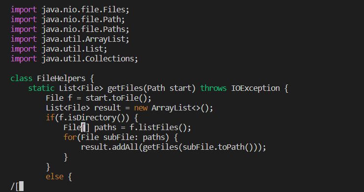
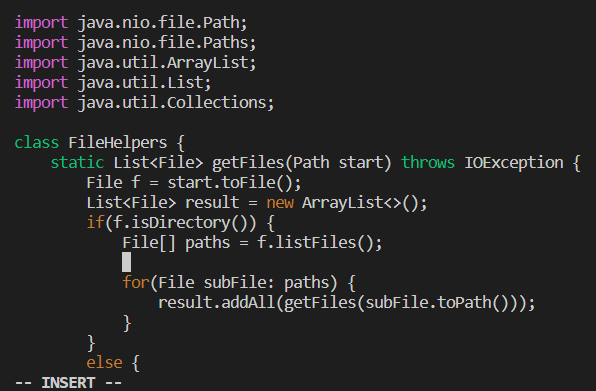
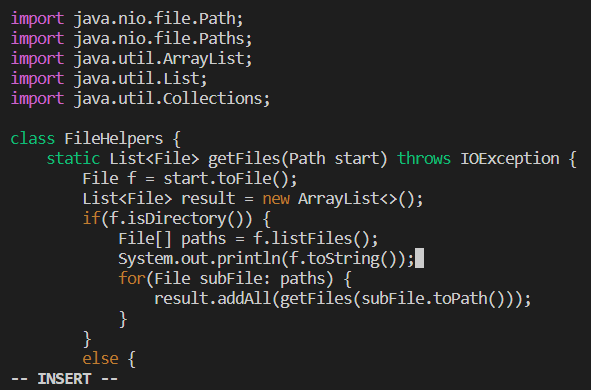

# Week 7 Lab Report #
## Part 1 - Adding new line to `print` before `File[] paths = f.listfiles()`
Keystrokes: `/[<enter>oSystem.out,println(f.toString());:w`

Searching for `[` :

`/[` places the cursor at the first instance of `[` , located at the line `File[] paths = f.listFiles();`.

Entering insert mode on a new line:

`o` creates a new line below the position of the cursor and puts us into insert mode.

Adding the line to print:

Now that the cursor is in the right position and we are in insert mode, we need to type in the code that prints a new line: `System.out.println(f.toString());`. We use :w to save the changes to the file.

## Part 2: Comparing scp and vim ##

Time taken to make changes using **scp**: 2 minutes 6 seconds

Main difficulty was typing out the scp and waiting for the file to copy over, which took the majority of the time.

Time taken to make changes using **vim**: 51 seconds

Main difficulty was remembering the commands to use in vim.

For working on a project being run remotely, I would prefer logging onto the remote server and using vim as it is much quicker than using scp. Typing out the scp command and figuring out which path to copy the file to took a lot of time and was not very convenient. However, using vim, I was able to make changes and save the file quickly and conveniently.

A factor that may affect my decision is how much I need to change in the remote server. If I only need to make a small change on the remote server such as adding/deleting a line, I would use vim as it is faster and more convenient than using scp. However, if I had to make multiple changes to multiple files, I would prefer making all changes locally and using scp to copy the entire directory over.
