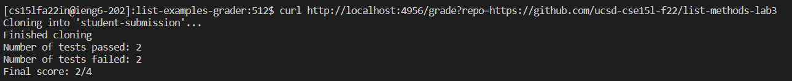
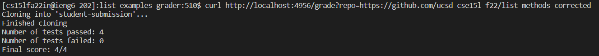
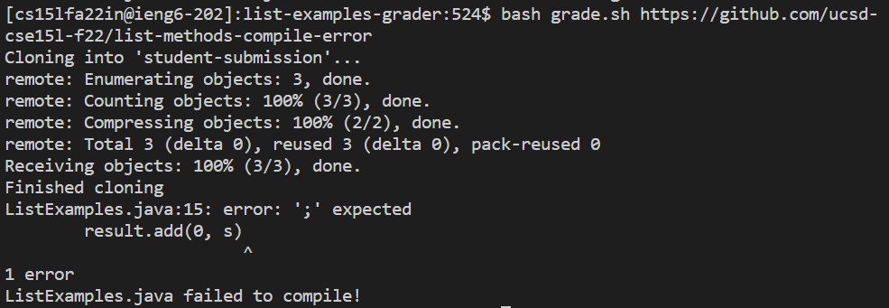

# Week 9 Lab Report #

## grade.sh script: ##

    CP=".:../lib/hamcrest-core-1.3.jar:../lib/junit-4.13.2.jar"
    rm -rf student-submission
    git clone $1 student-submission
    echo 'Finished cloning'
    cp TestListExamples.java student-submission/
    cd student-submission/

    if [[ !(-e ListExamples.java) ]]; then
        echo "ListExamples.java not found!"
        exit 1
    fi

    javac -cp $CP ListExamples.java
    if [[ $? -ne 0 ]]; then
        echo "ListExamples.java failed to compile!"
        exit 1
    fi

    javac -cp $CP TestListExamples.java
    if [[ $? -ne 0 ]]; then
        echo "TestListExamples.java failed to compile!"
        exit 1
    fi

    java -cp $CP org.junit.runner.JUnitCore TestListExamples|head -n 2|tail -n 1 > TestOutput.txt

    NUMTESTS=$(grep -o '\.' TestOutput.txt|wc -l)
    NUMFAILED=$(grep -o 'E' TestOutput.txt|wc -l)
    NUMPASSED=$(($NUMTESTS - $NUMFAILED))

    echo "Number of tests passed: $NUMPASSED"
    echo "Number of tests failed: $NUMFAILED"
    echo "Final score: $NUMPASSED/$NUMTESTS"

## Running Submissions Through GradeServer ##
Example 1: https://github.com/ucsd-cse15l-f22/list-methods-lab3

Example 2: https://github.com/ucsd-cse15l-f22/list-methods-corrected

Example 3: https://github.com/ucsd-cse15l-f22/list-methods-compile-error

## Tracing grade.sh on Example 3 ##
**First, the rm command is run to remove the previous student submission.**

    rm -rf student-submission

Standard Output: None

Standard Error: None

Return code: 0

**git clone is used to clone the repository that will be graded.**

    git clone $1 student-submission

Standard Output: Cloning into 'student-submission'...

Standard Error: git clone progress indicators

Return code: 0

**echo is used to indicate when git clone has finished.**

    echo 'Finished cloning'

Standard Output: Finished Cloning

Standard Error: None

Return code: 0

**cp is used to copy TestListExamples.java to student-submission/**

    cp TestListExamples.java student-submission/

Standard Output: None

Standard Error: None

Return code: 0

**The following if statement checks if a file named ListExamples.java exists within the working directory.**

    if [[ !(-e ListExamples.java) ]]

The condition is false as ListExamples.java is present in the submission. Therefore, the following lines do not run:

    echo "ListExamples.java not found!"
    exit 1

**javac is used to compile ListExamples.java. In this example, ListExamples.java fails to compile.**

    javac -cp $CP ListExamples.java

Standard Output: None

Standard Error: 

    ListExamples.java:15: error: ';' expected
        result.add(0, s)
                        ^
    1 error

Return code: Non-zero

**The following if statement checks if ListExamples.java compiled properly.**

    if [[ $? -ne 0 ]]

The condition is true as the exit code of the previous command (javac) is non zero. Therefore, the next 2 commands are run.

**echo is used to indicate that ListExamples.java failed to compile.**

    echo "ListExamples.java failed to compile!"

Standard Output: ListExamples.java failed to compile!

Standard Error: None

Exit code: 0

**exit is used to stop the grade.sh script early**

    exit 1

Standard Output: None

Standard Error: None

Exit code: 1

**Because the exit command was run, the rest of the grade.sh script is not run in this example.**